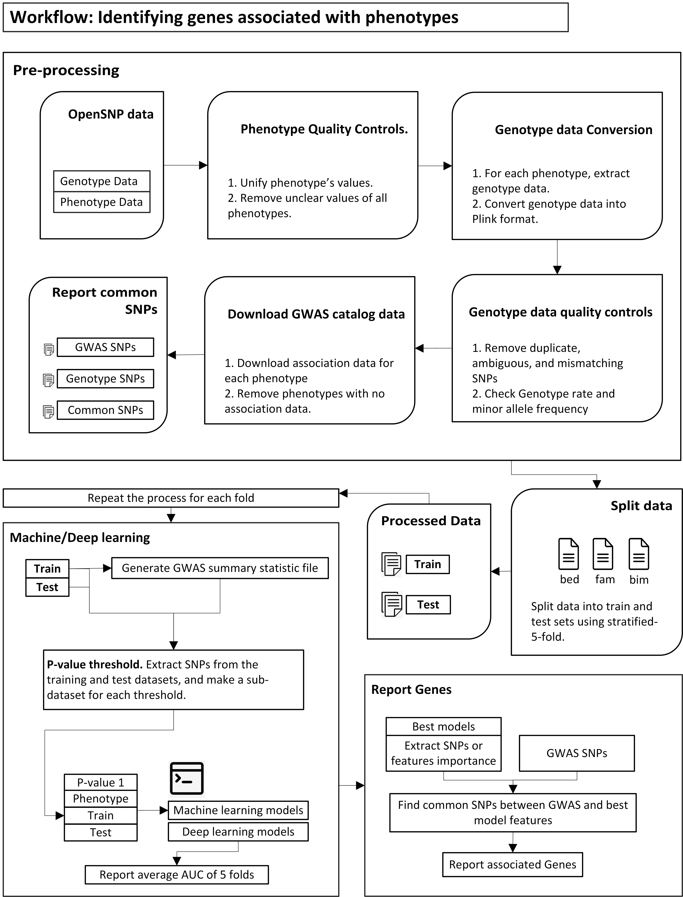
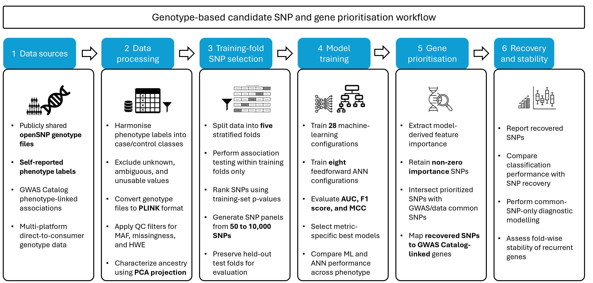
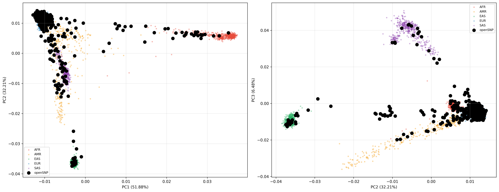
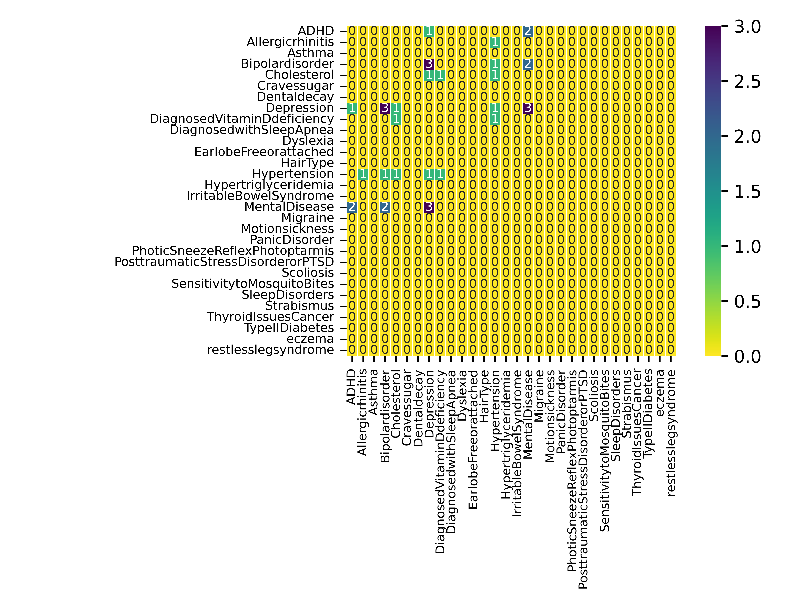

# Prediction is not prioritisation

## Genotype-based machine learning for GWAS-supported candidate gene recovery across openSNP phenotypes

<p align="center">
  
</p>

<p align="center">
  <strong>Phenotype classification • training-fold SNP selection • machine learning • neural networks • GWAS Catalog comparison • candidate SNP/gene recovery</strong>
</p>

> **Interpretation warning:** this repository prioritises **GWAS-supported candidate SNPs and genes**. Model feature importance, classification accuracy, and GWAS overlap do **not** establish causality, clinical validity, or a confirmed gene–phenotype relationship.

---

## Table of contents

- [Overview](#overview)
- [Study design](#study-design)
- [Workflow](#workflow)
- [Headline findings](#headline-findings)
- [Repository images](#repository-images)
- [Data availability](#data-availability)
- [Requirements](#requirements)
- [Installation](#installation)
- [Expected input structure](#expected-input-structure)
- [Complete pipeline](#complete-pipeline)
- [Step-by-step inputs and outputs](#step-by-step-inputs-and-outputs)
- [File catalogue](#file-catalogue)
- [Primary output files](#primary-output-files)
- [Important implementation notes](#important-implementation-notes)
- [Reproducibility checklist](#reproducibility-checklist)
- [Citation](#citation)
- [Authors](#authors)
- [Disclaimer](#disclaimer)

---

## Overview

This repository contains a genotype-based data-mining workflow for:

1. harmonising self-reported openSNP phenotypes into binary case–control labels;
2. converting heterogeneous direct-to-consumer genotype files to PLINK format;
3. performing genotype quality control and broad ancestry assessment;
4. constructing phenotype-matched GWAS Catalog comparator sets;
5. creating SNP panels using association statistics calculated from the **training data only**;
6. benchmarking machine-learning and neural-network models for phenotype classification;
7. extracting model-derived feature importance;
8. intersecting prioritised SNPs with phenotype-linked GWAS Catalog variants;
9. mapping recovered variants to GWAS-supported candidate genes; and
10. evaluating classification, recovery, null behaviour, and cross-fold stability as separate evidence dimensions.

The revised manuscript evaluates **35 phenotype-level case–control comparisons**, **28 machine-learning configurations**, and **eight feedforward artificial-neural-network configurations**. Models are evaluated using:

- area under the receiver operating characteristic curve (**AUC**);
- **F1 score**; and
- Matthews correlation coefficient (**MCC**).

The central conclusion is that **prediction is not prioritisation**: a model can classify phenotype labels while recovering few or no externally supported candidate genes.

---

## Study design

The analysis separates three questions that are often conflated:

1. **Prediction:** can genotype-derived SNP panels discriminate phenotype cases from controls?
2. **External support:** do model-prioritised SNPs overlap phenotype-linked GWAS Catalog evidence?
3. **Reproducibility:** are recovered SNPs and genes stable across data splits and robustness analyses?

Recovered genes are therefore reported as **prioritised candidates for further validation**, not as newly discovered causal genes.

---

## Workflow



The manuscript-aligned workflow contains six main stages:

1. **Data sources**  
   openSNP genotype files, self-reported phenotype labels, and phenotype-linked GWAS Catalog associations.

2. **Data processing**  
   Phenotype harmonisation, genotype conversion, quality control, and ancestry-context analysis.

3. **Training-fold SNP selection**  
   Stratified data splitting, association testing using training samples only, and generation of ranked SNP panels.

4. **Model training**  
   Machine-learning and feedforward neural-network classification using AUC, F1, and MCC.

5. **Candidate prioritisation**  
   Feature-importance extraction, GWAS overlap, and SNP-to-gene mapping.

6. **Recovery and stability**  
   SNP/gene recovery summaries, common-SNP-only diagnostics, null analyses, and fold-wise recurrence.

---

## Headline findings

- Classification performance was phenotype-dependent and generally modest.
- Machine-learning models achieved higher mean performance than feedforward neural-network models across AUC, F1, and MCC.
- Restricting models to SNPs directly shared with phenotype-matched GWAS Catalog sets generally reduced classification performance because direct overlap was often sparse.
- Many phenotype–model combinations showed measurable classification but recovered few or no GWAS-linked genes.
- Associations between classification performance and candidate-gene recovery were weak, negligible, or negative.
- Recurrent recovery across folds was limited to a subset of phenotype–model combinations.

These results support evaluating **predictive performance, external genetic support, empirical-null behaviour, ancestry sensitivity, and fold-wise stability together**.

---

## Repository images

### Study overview


### Population structure

The PCA figure places openSNP participants in the context of 1000 Genomes reference populations. It is descriptive context for ancestry composition and is not, by itself, a correction for residual population structure.



### Cross-phenotype result visualisations

<table>
  <tr>
    <td align="center">
      <br>
      <strong>Plot 1.</strong> Cross-phenotype overlap of prioritised SNPs.
    </td>
    <td align="center">
      <br>
      <strong>Plot 2.</strong> Cross-phenotype overlap of mapped candidate genes.
    </td>
  </tr>
  <tr>
    <td align="center">
      <br>
      <strong>Plot 3.</strong> Additional committed result visualisation.
    </td>
    <td align="center">
      <br>
      <strong>Plot 4.</strong> Additional committed result visualisation.
    </td>
  </tr>
</table>

---

## Data availability

The analysis originally used participant-contributed genotype files and self-reported phenotype information from openSNP.

> The openSNP service is no longer operational. The original participant-level genotype and phenotype files are **not redistributed** through this repository.

The repository contains analysis scripts, phenotype-harmonisation resources, model summaries, GWAS Catalog comparator outputs, and processed result files. Users must provide legally and ethically obtained input data in the expected local structure.

GWAS comparator information is obtained from the public NHGRI–EBI GWAS Catalog.

---

## Requirements

### Core software

- Python 3
- [PLINK 1.9](https://www.cog-genomics.org/plink/) or a compatible PLINK executable
- `wkhtmltopdf` only when PDF generation through `pdfkit` is required
- Internet access for downloading/querying the GWAS Catalog in Step 6

### Main Python packages

```text
pandas
numpy
scikit-learn
xgboost
tensorflow
keras
imbalanced-learn
matplotlib
seaborn
scipy
requests
Pillow
pdfkit
tabulate
natsort
squarify
yellowbrick
```

Some legacy deep-learning scripts also import additional packages. Install those only when running the corresponding legacy code.

---

## Installation

```bash
git clone https://github.com/MuhammadMuneeb007/Identifying-genes-associated-with-30-phenotypes-using-machine-deep-learning-.git

cd Identifying-genes-associated-with-30-phenotypes-using-machine-deep-learning-

python -m venv .venv

# Linux/macOS
source .venv/bin/activate

# Windows PowerShell
# .venv\Scripts\Activate.ps1

python -m pip install --upgrade pip
python -m pip install pandas numpy scikit-learn xgboost tensorflow keras \
  imbalanced-learn matplotlib seaborn scipy requests Pillow pdfkit \
  tabulate natsort squarify yellowbrick
```

Place the PLINK executable in the repository root or update the script commands to point to its installed location.

---

## Expected input structure

The preprocessing scripts currently assume a local openSNP data directory similar to:

```text
opensnp_datadump.current/
├── phenotypes_202208291325.csv
├── user*_file*_23andme_*.txt
├── user*_file*_ancestry_*.txt
└── other participant genotype files
```

Important supporting inputs include:

```text
postTransform.csv
phenotypes.txt
allphenotypesname2.txt
MachineLearningAlgorithms.txt
DeepLearningAlgorithms.txt
plink
```

### `postTransform.csv`

This is a manually curated phenotype-harmonisation table. Its core fields are expected to include:

| Column | Purpose |
|---|---|
| `phenovaluecount` | Separates phenotype headings from observed values |
| `prephenovalue` | Original phenotype name or raw response value |
| `postphenovalue` | Harmonised binary class or exclusion code |

The legacy scripts use values such as:

- binary case/control labels for retained observations;
- `U` for unknown or ambiguous observations;
- `x` for excluded values; and
- missing/blank markers that are removed before modelling.

---

## Complete pipeline

Because script names contain spaces, keep the filenames inside quotation marks.

### Step 1 — Screen the phenotype table

```bash
python "Step 1 - Preprocessing.py"
```

### Step 2 — Generate the pre-transformation phenotype-value table

```bash
python "Step 2 - Generate preTransform file.py"
```

Manually review `preTransform.csv`, define case/control/exclusion mappings, and save the curated table as `postTransform.csv`.

### Step 3 — Generate phenotype-specific classes and sample files

```bash
python "Step 3 - Generate Classes.py"
```

### Step 4 — Convert genotype files to PLINK format and perform initial QC

```bash
python "Step 4 - Convert data to plink format.py" ADHD
```

> **Current-code note:** the script also reads phenotype names from `phenotypes.txt`. Ensure this file exists and contains the phenotypes to process.

### Step 5 — Summarise phenotypes retained after genotype processing

```bash
python "Step 5 - List final phenotypes for analysis.py"
```

### Step 6 — Search the GWAS Catalog and save candidate comparator sets

```bash
python "Step 6 - Check if the phenotype is listed on GWAS Catalog.py" --top-n 20
```

Force a fresh GWAS Catalog download when required:

```bash
python "Step 6 - Check if the phenotype is listed on GWAS Catalog.py" \
  --force-download \
  --top-n 20
```

### Step 7 — Select phenotype-matched GWAS sets and identify shared SNPs

Process all configured phenotypes:

```bash
python "Step 7 - Find common SNPs between phenotype and GWAS Catalog.py" \
  --data-root .
```

Process one phenotype:

```bash
python "Step 7 - Find common SNPs between phenotype and GWAS Catalog.py" \
  --data-root . \
  --phenotype ADHD
```

Skip PubMed/BibTeX retrieval when required:

```bash
python "Step 7 - Find common SNPs between phenotype and GWAS Catalog.py" \
  --data-root . \
  --skip-citations
```

### Step 8 — Create stratified splits, run training-fold association tests, and export SNP panels

```bash
python "Step 8 - Generate p-values and GWAS.py" ADHD
```

This step creates fold-specific training and held-out test datasets, runs association testing on the training data, ranks SNPs, and exports genotype matrices for multiple SNP-panel sizes.

### Step 9 — Train machine-learning models

Run one phenotype and one fold:

```bash
python "Step 9 - Use Machine Learning Algorithm.py" ADHD 1
```

Run all five folds:

```bash
for fold in 1 2 3 4 5
do
  python "Step 9 - Use Machine Learning Algorithm.py" ADHD "$fold"
done
```

### Step 10 — Aggregate machine-learning performance and select metric-specific models

```bash
python "Step 10 - Get Machine Learning Results.py" AUC
python "Step 10 - Get Machine Learning Results.py" MCC
python "Step 10 - Get Machine Learning Results.py" f1score
```

### Step 11 — Recover GWAS-supported SNPs and candidate genes from machine-learning models

Process all phenotypes represented in the benchmark summaries:

```bash
python "Step 11 - List Identified Genes - Machine learning.py"
```

Process one phenotype:

```bash
python "Step 11 - List Identified Genes - Machine learning.py" \
  --phenotype Depression
```

### Step 12A — Run the legacy deep-learning sweep

The current legacy script requires a phenotype, fold, and p-value-panel folder:

```bash
python "Step 12 - Use Deep Learning Algorithms.py" ADHD 1 pv_0.001
```

Replace `pv_0.001` with an existing folder under `ADHD/1/`.

### Step 12B — Aggregate deep-learning performance

```bash
python "Step 12 - Get Deep Learning Results.py" AUC
python "Step 12 - Get Deep Learning Results.py" MCC
python "Step 12 - Get Deep Learning Results.py" f1score
```

### Step 12C — Refit a selected deep-learning configuration and extract feature importance

Command format:

```bash
python "Step 12 - Get Deep Learning Weights.py" \
  PHENOTYPE FOLD PV_FOLDER DROPOUT OPTIMIZER BATCH_SIZE EPOCHS
```

Example:

```bash
python "Step 12 - Get Deep Learning Weights.py" \
  ADHD 1 pv_0.001 0.2 Adam 1 50
```

### Step 13 — Generate legacy deep-learning candidate-gene summaries

```bash
python "Step 13 - List Identified Genes - Deep learning.py"
```

> **Portability warning:** this legacy script contains hard-coded Windows paths and must be refactored before it can run on another computer. Replace the hard-coded paths with repository-relative paths or command-line arguments.

### Step 14 — Combine machine-learning and deep-learning candidate results

```bash
python "Step 14 - Get all genes identified and plot common SNPs and genes between phenotypes.py"
```

This step combines the machine-learning and deep-learning SNP/gene sets and generates cross-phenotype overlap heatmaps.

> **Portability warning:** PDF generation currently refers to `wkhtmltopdf.exe`. Update the path or remove PDF generation when running on Linux/macOS.

### Step 15 — Plot final summary results

The previous README referred to:

```bash
python "Step 15 - Plot Results.py"
```

However, `Step 15 - Plot Results.py` is not currently tracked in the repository root. The committed `plot1.png`–`plot4.png` files can still be displayed, but the missing plotting script must be restored or recreated for complete regeneration.

---

## Step-by-step inputs and outputs

| Step | Script | Main input(s) | Main output(s) |
|---:|---|---|---|
| 1 | `Step 1 - Preprocessing.py` | `opensnp_datadump.current/phenotypes_202208291325.csv` | `Analysis1.html` |
| 2 | `Step 2 - Generate preTransform file.py` | Raw phenotype CSV | `preTransform.csv` |
| Manual | Phenotype mapping | `preTransform.csv` | Curated `postTransform.csv` |
| 3 | `Step 3 - Generate Classes.py` | Raw phenotype CSV; `postTransform.csv` | Phenotype folders; `<Phenotype>/<Phenotype>.csv`; `Analysis2.html`; `Analysis2.pdf` |
| 4 | `Step 4 - Convert data to plink format.py` | Phenotype sample files; participant genotype files; `phenotypes.txt`; PLINK | `final.QC.bed`; `final.QC.bim`; `final.QC.fam`; `Phenotype_process1.csv`; `Phenotype_process2.csv` |
| 5 | `Step 5 - List final phenotypes for analysis.py` | Processed phenotype folders and `final.QC.*` | `Analysis3.html`; `Analysis3.pdf` |
| 6 | `Step 6 - Check if the phenotype is listed on GWAS Catalog.py` | GWAS Catalog association dump; configured phenotype search terms | `Identify6.0_GWAS_Search/*`; `GWASCatalogDownloaded/<Phenotype>/*` |
| 7 | `Step 7 - Find common SNPs between phenotype and GWAS Catalog.py` | Candidate GWAS sets; phenotype `*.bim`/SNP files | Selected associations; common-variant files; master CSV/JSON/Markdown/LaTeX/BibTeX summaries |
| 8 | `Step 8 - Generate p-values and GWAS.py` | `<Phenotype>/final.QC.*` | Five fold directories; train/test PLINK files; association statistics; `pv_*`; `ptrain.raw`; `ptest.raw` |
| 9 | `Step 9 - Use Machine Learning Algorithm.py` | Fold-specific `ptrain.raw`, `ptest.raw`, and labels | Model importance CSVs; fold information; `Results_MachineLearning_AUC.csv`; MCC; F1 |
| 10 | `Step 10 - Get Machine Learning Results.py` | Five-fold ML result files; algorithm index; phenotype list | `Machinelearningbasedbechmarking<Metric>.csv`; `.html` |
| 11 | `Step 11 - List Identified Genes - Machine learning.py` | Best ML summaries; fold-wise feature importance; selected GWAS/common-SNP files | `GeneIdentification_Final/Final_Gene_Identification_Results.*`; phenotype-level recovery files |
| 12A | `Step 12 - Use Deep Learning Algorithms.py` | Fold-specific genotype matrices and labels | P-value-folder `Results_DeepLearning_AUC.csv`; MCC; F1 |
| 12B | `Step 12 - Get Deep Learning Results.py` | Deep-learning results across folds/panels | `Deeplearningbasedbechmarking<Metric>.csv`; `.html` |
| 12C | `Step 12 - Get Deep Learning Weights.py` | Selected phenotype/fold/panel/hyperparameters | Feature-masking importance CSVs |
| 13 | `Step 13 - List Identified Genes - Deep learning.py` | DL benchmark summaries; DL feature importance; GWAS common SNPs | `Deeplearning_Results_<Metric>.csv`; `Final_DeepLearning_Results.csv`; phenotype feature-importance files |
| 14 | `Step 14 - Get all genes identified and plot common SNPs and genes between phenotypes.py` | `Final_MachineLearning_Results.csv`; `Final_DeepLearning_Results.csv` | `Final_Results.csv`; `Final_Results.html`; `Final_Results.pdf`; `plot1.png`; `plot2.png` |
| 15 | `Step 15 - Plot Results.py` | Final result tables | Script currently missing; committed plots remain available |

---

## File catalogue

### Phenotype screening and harmonisation

| File | Description |
|---|---|
| `Analysis1.pdf` | Complete initial summary of phenotype columns available in the openSNP phenotype table. |
| `preTransform.csv` | Raw phenotype names, observed values, and value frequencies prepared for manual review. |
| `postTransform.csv` | Manually curated mapping from original phenotype values to binary classes or exclusion codes. |
| `Analysis2.pdf` | Summary of phenotypes retained after manual phenotype transformation and class construction. |
| `Analysis3.pdf` | Summary of phenotype cohorts remaining after genotype conversion and initial quality control. |

### Algorithm definitions

| File | Description |
|---|---|
| `MachineLearningAlgorithms.txt` | Index and names of the machine-learning configurations used by the pipeline. |
| `DeepLearningAlgorithms.txt` | Index, architecture, dropout, optimiser, batch-size, and epoch settings used by the legacy deep-learning pipeline. |

### Classification-performance summaries

| File | Description |
|---|---|
| `Machinelearning_Results_AUC.csv` | Machine-learning classification results selected/summarised by AUC. |
| `Machinelearning_Results_MCC.csv` | Machine-learning classification results selected/summarised by MCC. |
| `Machinelearning_Results_f1score.csv` | Machine-learning classification results selected/summarised by F1 score. |
| `Deeplearning_Results_AUC.csv` | Deep-learning classification results selected/summarised by AUC. |
| `Deeplearning_Results_MCC.csv` | Deep-learning classification results selected/summarised by MCC. |
| `Deeplearning_Results_f1score.csv` | Deep-learning classification results selected/summarised by F1 score. |

### Candidate SNP and gene summaries

| File | Description |
|---|---|
| `Final_MachineLearning_Results.csv` | Legacy machine-learning candidate SNP/gene recovery summary. |
| `Final_DeepLearning_Results.csv` | Legacy deep-learning candidate SNP/gene recovery summary. |
| `Final_Results.csv` | Combined union of candidate SNPs and mapped genes prioritised by the legacy ML and DL workflows. |
| `Final_Results.html` | Browser-readable version of the combined final result table. |
| `Final_Results.pdf` | PDF rendering of the combined final result table. |

### Revised machine-learning recovery outputs

| Path | Description |
|---|---|
| `GWASCatalogDownloaded/<Phenotype>/` | Phenotype-specific GWAS candidate, selected-association, common-variant, gene, and summary files. |
| `GWASCatalogDownloaded/GWAS_Common_Variants_Master_Summary.csv` | Master summary of selected phenotype–GWAS comparator sets and variant overlap. |
| `GWASCatalogDownloaded/GWAS_Common_Variants_Master_Citations.bib` | BibTeX entries for the selected GWAS evidence. |
| `GeneIdentification_Final/Final_Gene_Identification_Results.csv` | Revised machine-learning SNP/gene recovery summary. |
| `GeneIdentification_Final/Final_Gene_Identification_Results.md` | Markdown table of revised recovery results. |
| `GeneIdentification_Final/Final_Gene_Identification_Table.tex` | Manuscript-ready LaTeX recovery table. |
| `GeneIdentification_Final/<Phenotype>/` | Phenotype- and metric-specific prioritised SNPs, recovered SNPs, mapped genes, and supporting files. |

### Figures

| File | Description |
|---|---|
| `diagrams.png` | High-level project overview used at the beginning of this README. |
| `flowchart.jpg` | Manuscript-aligned end-to-end candidate SNP/gene prioritisation workflow. |
| `ancestry_pca.png` | PCA projection of openSNP participants relative to 1000 Genomes reference populations. |
| `plot1.png` | Pairwise cross-phenotype overlap heatmap for prioritised SNPs. |
| `plot2.png` | Pairwise cross-phenotype overlap heatmap for mapped candidate genes. |
| `plot3.png` | Additional committed result visualisation. |
| `plot4.png` | Additional committed result visualisation. |

---

## Primary output files

For manuscript-aligned interpretation, prefer the revised outputs under:

```text
GWASCatalogDownloaded/
GeneIdentification_Final/
```

The root-level files below are retained for compatibility with the original pipeline:

```text
Machinelearning_Results_*.csv
Deeplearning_Results_*.csv
Final_MachineLearning_Results.csv
Final_DeepLearning_Results.csv
Final_Results.csv
Final_Results.html
Final_Results.pdf
```

Do not interpret a non-zero feature-importance score or a mapped gene in these files as evidence of causality.

---

## Important implementation notes

### 1. Manuscript and legacy deep-learning code are not identical

The revised manuscript reports **eight feedforward ANN configurations**. The current legacy Step 12 script also contains GRU, LSTM, bidirectional LSTM, and stacked recurrent architectures. Use a manuscript-aligned feedforward-only configuration when reproducing the revised paper.

### 2. Verify the train/test split before exact manuscript reproduction

The revised manuscript describes five stratified folds with an 80% training and 20% held-out test allocation. The current Step 8 script uses `test_size=0.25`. Align the implementation and manuscript before producing final reproducibility claims.

### 3. Training-fold feature selection is essential

Association testing and SNP ranking must use training samples only. Test samples must remain held out until final model evaluation to prevent feature-selection leakage.

### 4. Step 4 also reads `phenotypes.txt`

Although the command accepts a phenotype argument, the current script subsequently loads phenotype names from `phenotypes.txt`. Review this behaviour before running a single phenotype.

### 5. Step 13 contains hard-coded paths

The deep-learning gene-recovery script includes machine-specific Windows paths. Replace these with repository-relative paths, environment variables, or command-line arguments.

### 6. Step 14 contains a local `wkhtmltopdf.exe` assumption

Update the `pdfkit` configuration for your operating system or disable PDF generation.

### 7. Step 15 is absent

The plotting command was documented in the previous README, but the corresponding script is not currently present.

### 8. Direct rsID overlap is conservative

A model-prioritised variant may tag an externally reported GWAS variant through linkage disequilibrium without sharing the same rsID. Direct overlap therefore provides a conservative and incomplete recovery measure.

### 9. Population structure remains a possible signal source

The ancestry PCA provides context, but ancestry principal components were not included as covariates in the primary predictive models described in the manuscript. Residual population structure should therefore be considered when interpreting predictive performance and feature importance.

### 10. Exploratory model selection

The same cross-validation summaries are used to compare and select metric-specific configurations. Selected performance values should be treated as exploratory comparative summaries rather than unbiased estimates from fully nested cross-validation.

---

## Reproducibility checklist

Before reporting results, confirm that:

- [ ] phenotype labels were independently reviewed and documented;
- [ ] unknown, ambiguous, and excluded responses were removed consistently;
- [ ] sample counts and class imbalance were recorded for every phenotype;
- [ ] genotype QC parameters were fixed and reported;
- [ ] duplicate samples and SNPs were removed;
- [ ] ancestry composition was assessed and considered during interpretation;
- [ ] GWAS comparator search terms and final selections were saved;
- [ ] SNP ranking was performed within training data only;
- [ ] the same predefined SNP-panel sizes were evaluated across model families;
- [ ] scaling was fitted on training data and applied to held-out data;
- [ ] AUC, F1, and MCC were evaluated on held-out samples;
- [ ] feature importance was saved separately for every fold;
- [ ] recovered SNPs were mapped using the selected phenotype-specific GWAS rows;
- [ ] both available-evidence and model-panel recovery denominators were reported;
- [ ] null/permutation behaviour was assessed where applicable;
- [ ] cross-fold recurrence and stability were evaluated;
- [ ] candidate genes were not described as causal discoveries.

---

## Citation

Please cite the accompanying manuscript when using this repository:

> Muneeb M, Ascher DB, Myung Y. **Prediction is not prioritisation: evaluating genotype-based machine learning for GWAS-supported candidate gene recovery across openSNP phenotypes.** Manuscript, 2026.

BibTeX template:

```bibtex
@article{muneeb2026prediction,
  title   = {Prediction is not prioritisation: evaluating genotype-based machine learning for GWAS-supported candidate gene recovery across openSNP phenotypes},
  author  = {Muneeb, Muhammad and Ascher, David B. and Myung, YooChan},
  year    = {2026},
  note    = {Manuscript; update this record when journal, volume, pages, and DOI are available}
}
```

---

## Authors

- **Muhammad Muneeb** — study conception, computational framework, data curation and processing, implementation, analysis, interpretation, figures, tables, and manuscript drafting
 
---

## Disclaimer

This repository is provided for research and reproducibility purposes.

- It is not a clinical diagnostic system.
- It does not provide medical advice.
- Model-derived importance does not establish biological mechanism.
- GWAS overlap supports external plausibility but does not establish causality.
- Recovered genes require independent statistical, functional, and experimental validation.
- Users are responsible for complying with all data-access, consent, privacy, ethics, and licensing requirements.

No licence file is currently included in the repository. Unless a licence is added, do not assume permission for redistribution or reuse beyond applicable law.
