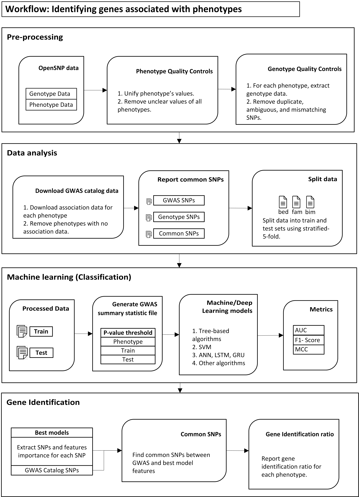

# Identifying genes associated with phenotypes using machine and deep learning 
Identifying genes associated with phenotypes using machine and deep learning 

**Files**

1. **Analysis1.pdf** A complete list of all the phenotypes in the openSNP dataset.
2. **preTransform.csv** contains phenotypes and values. **postTransform.csv** contains phenotypes, values, and **transformed values**. 
3. **Analysis2.pdf** A complete list of all the phenotypes we transformed.
4. **Analysis3.pdf** A complete list of all the phenotypes after initial quality controls on genotype data.
5. **MachineLearningAlgorithms.txt** A complete list of machine learning algorithms.
6. **DeepLearningAlgorithms.txt** A complete list of deep learning algorithms.
7. **Plink_PRSice_Lassosum_Parameters.txt** A complete list of PRS tools paramters.

**Commands**

**python Step 1 - Preprocessing.py**

**python Step 2 - Generate preTransform file.py**

**python Step 3 - Generate Classes.py**

**python Step 4 - Convert data to plink format.py Phenotype_Name**

python Step 4 - Convert data to plink format.py ADHD

**python Step 5 - List final phenotypes for analysis.py**

**Step 6 - Check if the phenotype is listed on GWAS Catalog.md**

**python Step 7 - Find common SNPs between phenotype and GWAS Catalog.py**

**python Step 8 - Generate p-values and GWAS.py Phenotype_Name**

python Step 8 - Generate p-values and GWAS.py ADHD

**python Step 9 - Use machine learning algorithm.py Phenotype_Name Iteration**

python Step 9 - Use machine learning algorithm.py ADHD 1

python Step 9 - Use machine learning algorithm.py ADHD 2

python Step 9 - Use machine learning algorithm.py ADHD 3

python Step 9 - Use machine learning algorithm.py ADHD 4

python Step 9 - Use machine learning algorithm.py ADHD 5

**python Step 10 - Get Machine Learning Results.py  Metric**

python Step 10 - Get Machine Learning Results.py  MCC

python Step 10 - Get Machine Learning Results.py  AUC

**python Step 11 - List Identified Genes - Machine learning**

This step lists all the genes with the best-performing machine learning algorithms identified in terms of AUC, MCC, and F1 scores.

**python Step 12 - Use Deep Learning Algorithms.py**

First, train the deep learning algorithms. Second, extract the best-performing models regarding MCC, AUC, and F1 Score. Third, extract the weights for those models. 

**python Step 12 - Get Deep Learning Results.py**

 Second, extract the best-performing models regarding MCC, AUC, and F1 Score.

**python Step 12 - Get Deep Learning Weights**

Third, extract the weights for those models. 

**python Step 13 - List Identified Genes - Deep learning.py**

This step lists all the genes with the best-performing deep learning algorithms identified in terms of AUC, MCC, and F1 scores.

**python Step 13 - List Identified Genes - Deep learning.py**

This step lists all the genes with the best-performing deep learning algorithms identified in terms of AUC, MCC, and F1 scores.

